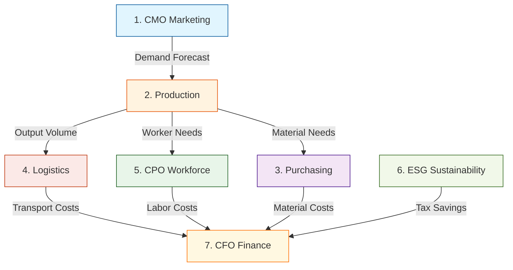
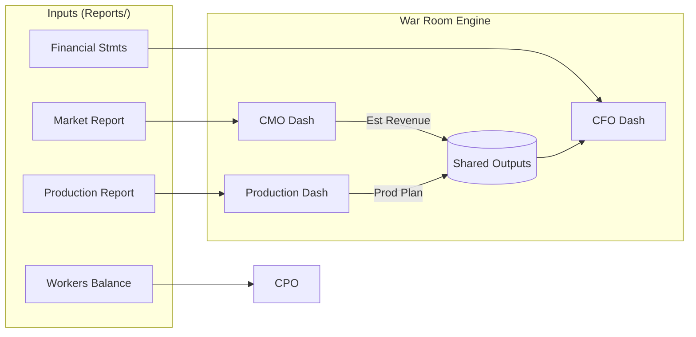

# ExSim War Room - Master User Manual
**Version 3.0 | January 2026**

Welcome to the **ExSim War Room**, the elite decision-support suite for the ExSim Business Simulation. This manual is your comprehensive guide to mastering the seven integrated dashboards. It goes beyond simple "how-to" instructions to explain the **strategic logic** and **mathematical rationale** behind every tool.

---

## 📚 Table of Contents
1.  [System Architecture & Workflow](#1-system-architecture--workflow)
2.  [Global Data Flow](#2-global-data-flow)
3.  [CMO Dashboard (Marketing)](#3-cmo-dashboard-marketing--innovation)
4.  [Production Dashboard (Manufacturing)](#4-production-dashboard-manufacturing)
5.  [Purchasing Dashboard (Sourcing)](#5-purchasing-dashboard-sourcing)
6.  [Logistics Dashboard (Supply Chain)](#6-logistics-dashboard-supply-chain)
7.  [CPO Dashboard (Workforce)](#7-cpo-dashboard-workforce)
8.  [ESG Dashboard (Sustainability)](#8-esg-dashboard-sustainability)
9.  [CFO Dashboard (Finance)](#9-cfo-dashboard-finance)
10. [Known Issues & Best Practices](#10-known-issues--best-practices)
11. [Appendix A: Formula Index](#appendix-a-formula-index)
12. [Appendix B: Case Reference Index](#appendix-b-case-reference-index)

---

## 1. System Architecture & Workflow

The War Room operates as a **Cascade System**. This means you cannot make decisions in isolation. A change in your Marketing strategy (CMO) ripples down to Production, which impacts Purchasing and Logistics, all of which determine your Financial health.

**Recommended Execution Order:**

---

## 2. Global Data Flow

Dashboards rely on two types of data:
1.  **ExSim Reports:** Raw Excel files exported from the simulation (located in `Reports/`).
2.  **Shared Outputs:** Python-generated data passed between dashboards (stored in `shared_outputs.json`).

---

## 3. CMO Dashboard (Marketing & Innovation)

### 🎯 Objective
**Maximize Market Share & Margin.**  
The goal is NOT just to sell more, but to sell *profitably*. You need to find the "sweet spot" price that maximizes the Contribution Margin `(Price - Cost) * Volume` while spending just enough on Media (TV/Internet) to maintain awareness.

### 🛠 Usage Guide
1.  **Segment Pulse:** Look for red flags. If "High Segment Awareness" is < 30%, you are invisible to premium buyers.
2.  **Strategy Cockpit:**
    *   **Price Slider:** Move this up/down. Watch the **Est. Revenue** metric change.
    *   **TV Budget:** Input a value (e.g., $50,000). The dashboard will estimate the awareness gain.
    *   **Zone Forecast:** Enter your *Target Demand*. **Crucial:** Be realistic. If you forecast 10k units but only have capacity for 5k, you leave money on the table.

### 🧠 Logic & Rationale
*   **Awareness Decay:** Awareness drops by ~5-10% every round if you stop advertising. The dashboard calculates the "maintenance spend" needed to hold steady.
*   **Price Sensitivity:** The High segment is less price-sensitive than the Low segment. The dashboard uses different elasticity curves for each to predict demand.

### 📥 Input Data
| File / Source | Data extracted |
| :--- | :--- |
| `market_report.xlsx` | Market share, competitor prices, awareness levels |
| `product_features.xlsx` | Available innovation features and costs |

### 🧮 Key Formulas
- **Awareness Gap:** `100% - Current Awareness` (Target for TV/Internet spend)
- **Est. Revenue:** `Target Demand * Price`
- **Contribution Margin:** `(Price - Unit Cost) * Target Demand`

### 📤 Output Deliverables
| Tab | Description |
| :--- | :--- |
| `UPLOAD_READY_MARKETING` | Copy-paste Pricing, TV, Internet, and Staffing decisions |
| `UPLOAD_READY_INNOVATION` | Binary (1/0) decisions for R&D features |

---

## 4. Production Dashboard (Manufacturing)

### 🎯 Objective
**100% Fulfillment with 0% Waste.**  
Your job is to translate the CMO's "Dream Demand" into "Physical Reality". You must ensure you have enough Machines and Workers in the right Zones to build the product.

### 🛠 Usage Guide
1.  **Zone Calculators:**
    *   **Target Production:** This defaults to the CMO's forecast. Reduce it if you lack capacity.
    *   **Overtime Toggle:** Switch to `YES` if `Real Output < Target`. This costs 50% more per unit but saves the sale.
2.  **Resource Manager:**
    *   **Buy Machines:** If `Utilization > 100%`, the dashboard recommends buying machines (e.g., "+2 M1").

### 🧠 Logic & Rationale
*   **Zone Independence:** A machine in the West cannot build products for the East. The dashboard treats each zone as a separate factory.
*   **Bottleneck Analysis:** Output is limited by the *scarcest* resource: `Min(Machine Capacity, Worker Capacity, Material Availability)`.

### 📥 Input Data
| File / Source | Data extracted |
| :--- | :--- |
| `production_report.xlsx` | Current machines, utilization, and capacity |
| `Shared: CMO` | **Target Demand** (Sales Forecast) per zone |

### 🧮 Key Formulas
- **Effective Capacity:** `(Machines * Machine_Rate + Workers * Worker_Rate) * Efficiency`
- **Capacity Gap:** `Target Production - Effective Capacity`
- **Machine ROI:** `(Price - Scrap Value) / Payback Period`

### 📤 Output Deliverables
| Tab | Description |
| :--- | :--- |
| `UPLOAD_READY_PRODUCTION` | Production targets and machine purchase orders |

---

## 5. Purchasing Dashboard (Sourcing)

### 🎯 Objective
**Prevent Stockouts ("The Silent Killer").**  
If you run out of raw materials, the factory stops. Purchasing uses **MRP (Material Requirements Planning)** to back-calculate exactly when to order based on supplier lead times.

### 🛠 Usage Guide
1.  **Supplier Config:** Verify Lead Times (e.g., 2 Fortnights).
2.  **MRP Engine:**
    *   Look at the **Order Matrix**.
    *   **Red Cells:** Indicate a future stockout. You MUST order in the column *before* the red cell starts to account for lead time.
3.  **Cost Analysis:** Switch suppliers if one becomes too expensive, but beware of quality drops.

### 🧠 Logic & Rationale
*   **Time Travel Rule:** In ExSim, an order placed in Week 1 with a 2-week lead time arrives in Week 3. The dashboard shifts your "Need Date" back by the lead time to give you the "Order Date".
*   **EOQ (Economic Order Quantity):** It balances `Ordering Cost` (flat fee per order) vs. `Holding Cost` (warehousing rent). It's cheaper to place fewer large orders than many small ones.

### 📥 Input Data
| File / Source | Data extracted |
| :--- | :--- |
| `suppliers.xlsx` | Lead times, batch sizes, and unit costs |
| `Shared: Production` | **Target Production** (Material Requirement Driver) |

### 🧮 Key Formulas
- **Net Requirement:** `Target Production - Beginning Inventory - Scheduled Receipts`
- **Order Timing:** `Order FN = Need FN - Lead Time`
- **Stockout Risk:** If `Projected Inventory < 0`, cell turns **RED**.

### 📤 Output Deliverables
| Tab | Description |
| :--- | :--- |
| `UPLOAD_READY_PROCUREMENT` | Supplier orders (Quantity & Supplier) per fortnight |

---

## 6. Logistics Dashboard (Supply Chain)

### 🎯 Objective
**Balance the Network.**  
You might produce in the West but sell in the East. Logistics plans the shipments to move goods to where the customers are, avoiding stockouts in sales zones and overflows in factory zones.

### 🛠 Usage Guide
1.  **Inventory Tetris:**
    *   **Left Side:** Origin Zones (Factories). If bars are Purple (Full), ship OUT.
    *   **Right Side:** Destination Zones (Markets). If bars are Red (Empty), ship IN.
2.  **Shipment Builder:**
    *   Add a route: `West -> East`.
    *   Choose Mode: `Train` (Cheap/Slow) vs `truck` (Avg) vs `Plane` (Fast/Pricey).
    *   The "Arrival FN" updates automatically.

### 🧠 Logic & Rationale
*   **Lead Time vs. Cost Trade-off:** Planes are instant (0 FN) but cost $25/unit. Trains take 2 FN but cost $5/unit. The dashboard hints: "Use Trains for base load, Planes for emergencies."
*   **Warehouse Cap:** If you exceed storage limits, ExSim charges massive overflow penalties. The dashboard flags this as **CRITICAL OVERFLOW**.

### 📥 Input Data
| File / Source | Data extracted |
| :--- | :--- |
| `logistics.xlsx` | Shipping costs per mode (Train/Truck/Plane) |
| `Shared: Production` | **Factory Output** (Supply) |
| `Shared: CMO` | **Target Sales** (Demand) |

### 🧮 Key Formulas
- **Ending Inventory:** `Begin Inv + Production + Incoming Shipments - Sales - Outgoing Shipments`
- **Warehouse Utilization:** `Ending Inventory / Warehouse Capacity` (Alert if > 100%)
- **Shipment Cost:** `Qty * Cost_Per_Unit_Mode` (Train=$5, Truck=$10, Plane=$25)

### 📤 Output Deliverables
| Tab | Description |
| :--- | :--- |
| `UPLOAD_READY_LOGISTICS` | Shipping decisions (Origin -> Dest, Mode, Qty) |

---

## 7. CPO Dashboard (Workforce)

### 🎯 Objective
**Zero Strikes, High Motivation.**  
Unhappy workers strike (0 production) or work slowly (low efficiency). The CPO dashboard calculates exactly how much to pay to keep them happy without overspending.

### 🛠 Usage Guide
1.  **Workforce Planning:**
    *   **Hiring Needed:** Automatically calculated from Production's machine plan.
    *   **Turnover:** Adjust this slider. High turnover means you constantly pay firing/hiring costs.
2.  **Compensation Strategy:**
    *   **Salary Input:** Enter a raise (e.g., +3%).
    *   **Strike Risk Meter:** If this points to Red, INCREASE SALARY immediately. Most strikes happen because salary didn't keep up with inflation.

### 🧠 Logic & Rationale
*   **Inflation Catch-up:** Workers verify their real purchasing power. If Inflation is 5% and you give a 2% raise, they explicitly lose money. The dashboard flags this as a "Real Wage Cut".
*   **Safety Threshold:** Workers accept lower wages if Safety/Training budgets are high.

### 📥 Input Data
| File / Source | Data extracted |
| :--- | :--- |
| `workers_balance.xlsx` | Current staff count and absenteeism rate |
| `Shared: Production` | **Required Workers** (Headcount Target) |

### 🧮 Key Formulas
- **Strike Risk Threshold:** `Prev Profit Share > 0 OR New Salary < Prev Salary * (1 + Inflation)`
- **Hiring Need:** `Max(0, Required Workers - (Current Staff - Turnover))`
- **Labor Cost:** `(Base Salary + Benefits) * Headcount`

### 📤 Output Deliverables
| Tab | Description |
| :--- | :--- |
| `UPLOAD_READY_PEOPLE` | Hiring/Firing counts, New Salaries, Benefit % |

---

## 8. ESG Dashboard (Sustainability)

### 🎯 Objective
**Turn "Green" into "Gold".**  
Carbon taxes can eat 10-20% of your profit. This dashboard acts as an investment banker for sustainability, comparing the ROI of Solar vs. Trees vs. Credits.

### 🛠 Usage Guide
1.  **Strategy Selector:**
    *   Review the **Pareto Chart**. It ranks initiatives by "Cost per Ton of CO2 Saved".
    *   **Solar PV:** High upfront cost, but pays for itself in ~3 years.
    *   **Trees:** Low impact, but good for PR.
2.  **Decision:** Allocate budget to the initiative with the steepest slope (highest efficiency).

### 🧠 Logic & Rationale
*   **Abatement Curve:** The dashboard builds a marginal abatement cost curve (MACC). It advises you to "Pick the low hanging fruit first" (cheapest reductions).
*   **Tax Shield:** Every $1 spent on effective green tech saves $X in future tax.

### 📥 Input Data
| File / Source | Data extracted |
| :--- | :--- |
| `esg_report.xlsx` | Current CO2 emissions and Tax Bill |

### 🧮 Key Formulas
- **Payback (Solar):** `Installation Cost / Annual Tax Savings`
- **Tax Liability:** `(Emissions - Reductions) * Tax Rate`
- **Efficiency:** `Cost / Ton of CO2 Reduced`

### 📤 Output Deliverables
| Tab | Description |
| :--- | :--- |
| `UPLOAD_READY_ESG` | Investments in Solar, Trees, Credits, Green Energy |

---

## 9. CFO Dashboard (Finance)

### 🎯 Objective
**The Final Sanity Check.**  
Before you hit "Submit" in ExSim, the CFO dashboard aggregates every dollar spent by CMO, CIO, CPO, etc., to tell you if you will go bankrupt.

### 🛠 Usage Guide
1.  **Liquidity Monitor:**
    *   **Ending Cash:** Look at the bottom row.
    *   **RED (< 0):** You are insolvent. You MUST take an emergency loan or cut marketing/machine spend.
    *   **GREEN (> $200k):** You have idle cash. Pay down debt or invest in innovation.
2.  **Debt Manager:**
    *   Calculates new loan payments. Use this if your Ending Cash is Red.

### 🧠 Logic & Rationale
*   **Cash Flow vs. Profit:** You can be profitable (high sales) but bankrupt (ran out of cash to pay suppliers). The CFO dashboard focuses on *Liquidity* (Cash on hand).
*   **Credit Rating:** If `Debt / Assets > 60%`, the bank considers you "High Risk" and hikes interest rates.

### 📥 Input Data
| File / Source | Data extracted |
| :--- | :--- |
| `financial_statements.xlsx`| Assets, Liabilities, Equity, Retained Earnings |
| `Shared: All Dashboards` | Aggregated Spending (Marketing + Machines + Materials + Labor + Logistics) |

### 🧮 Key Formulas
- **Ending Cash:** `Begin Cash + Inflows (Sales, Loans) - Outflows (Spend, Tax, Dividends)`
- **Solvency Check:** If `Ending Cash < 0` -> **INSOLVENT** (Emergency Loan required)
- **Debt Ratio:** `Total Liabilities / Total Assets` (Must be < 60% for good credit)

### 📤 Output Deliverables
| Tab | Description |
| :--- | :--- |
| `UPLOAD_READY_FINANCE` | Loan requests, Credit Line changes, Dividends |

---

## 10. Known Issues & Best Practices

> [!WARNING]
> **Files Must Remain in `Reports/`**: The dashboards look for files in specific locations. Do not rename or move the `Reports` folder.

> [!IMPORTANT]
> **Cascade Order Matters**: Always run **CMO first** and **CFO last**. If you change the Marketing plan, you must re-run Production, Purchasing, etc., to update the CFO's data.

*   **Hardcoded Fortnights:** The system is currently pegged to a standard 8-fortnight round.
*   **Zero Values:** If a dashboard is all zeros, verify that the `Reports` folder has valid Excel files and not just empty templates.
*   **Time Travel logic:** Purchasing logic assumes strict lead times. If you order late, materials *will* arrive late.

---

## Appendix A: Formula Index

A consolidated reference for the math powering the War Room.

### Marketing (CMO)
*   **Market Share %**: `Company Sales / Total Market Sales`
*   **Price Elasticity**: `(Change in Qty / Qty) / (Change in Price / Price)` (Implicit in simulation)

### Production
*   **Utilization Rate**: `Actual Output / Max Capacity`
*   **Scrap Rate**: `Defects / Total Production`

### Supply Chain (Purchasing & Logistics)
*   **EOQ (Economic Order Quantity)**: `Sqrt((2 * Demand * OrderingCost) / HoldingCost)` (Guidance only)
*   **Safety Stock**: `(Max Daily Usage * Max Lead Time) - (Avg Daily Usage * Avg Lead Time)`

### HR & Finance (CPO & CFO)
*   **Net Profit**: `Revenue - COGS - Expenses - Interest - Tax`
*   **Note on Strike Logic**: Strikes are probabilistic but highly correlated with `Salary < Inflation Adjusted Previous` and `Low Safety Budget`.
*   **Liquidity Ratio**: `Current Assets / Current Liabilities`

---

## Appendix B: Case Reference Index

Map the dashboard inputs back to the original `ExSim Case.pdf` for cross-verification.

| Dashboard | Case Data Point | Table/Graph Ref |
| :--- | :--- | :--- |
| **CMO** | Customer Sensitivity (Price vs. Quality) | **Graph 3.1: Segment Preferences** |
| **Production** | Machine Capacity & Setup Costs | **Table 4.2: Machine Specifications** |
| **Purchasing** | Supplier Lead Times & Costs | **Table 5.1: Supplier Contract Terms** |
| **Logistics** | Transportation Lead Times & Costs | **Table 6.3: Logistics Matrix** |
| **CPO** | Minimum Wage & Inflation Base | **Page 12: Economic Indicators** |
| **ESG** | CO2 Tax Rate per Ton | **Page 15: Regulatory Framework** |
| **CFO** | Bank Interest Rates & Credit Limits | **Table 8.1: Financing Terms** |
